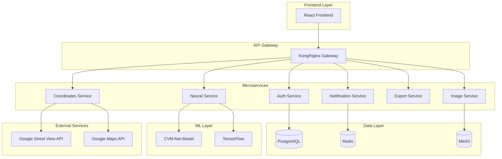

# Архитектура системы

## Обзор

Система распознавания географических координат построена на микросервисной архитектуре с использованием современных технологий и подходов.

## Диаграмма архитектуры



## Компоненты системы

### 1. Frontend Layer

**Технологии:** React 18+, TypeScript, Material-UI

**Функции:**
- Пользовательский интерфейс
- Загрузка изображений
- Отображение результатов
- Управление экспортом данных

**Структура:**
```
frontend/
├── src/
│   ├── components/     # React компоненты
│   ├── pages/         # Страницы приложения
│   ├── services/      # API сервисы
│   ├── store/         # Redux store
│   └── utils/         # Утилиты
├── public/
└── package.json
```

### 2. API Gateway

**Технологии:** FastAPI, Python

**Функции:**
- Маршрутизация запросов
- Аутентификация и авторизация
- Rate limiting
- Логирование запросов
- Балансировка нагрузки

**Особенности:**
- Проксирование запросов к микросервисам
- Обработка ошибок
- Кэширование ответов
- Мониторинг производительности

### 3. Микросервисы

#### Auth Service
**Функции:**
- Аутентификация пользователей
- Управление JWT токенами
- Авторизация и роли
- Управление сессиями

#### Image Processing Service
**Функции:**
- Детекция зданий на изображениях
- Предобработка изображений
- Обрезка и сегментация
- Сохранение в файловом хранилище

#### Neural Network Service
**Функции:**
- Загрузка CVM-Net модели
- Предсказание координат
- Обработка изображений
- Кэширование результатов

#### Coordinates Service
**Функции:**
- Получение адресов по координатам
- Интеграция с Google APIs
- Расчет расстояний
- Геокодирование

#### Export Service
**Функции:**
- Экспорт в XLSX
- Создание ZIP архивов
- Форматирование данных
- Генерация отчетов

#### Notification Service
**Функции:**
- Отправка уведомлений
- Управление подписками
- Очереди сообщений
- Email/SMS интеграция

### 4. Data Layer

#### PostgreSQL
**Назначение:**
- Основная база данных
- Пользователи и сессии
- Метаданные изображений
- История обработки

**Схема:**
```sql
-- Пользователи
CREATE TABLE users (
    id SERIAL PRIMARY KEY,
    username VARCHAR(50) UNIQUE NOT NULL,
    email VARCHAR(100) UNIQUE NOT NULL,
    password_hash VARCHAR(255) NOT NULL,
    role VARCHAR(20) DEFAULT 'user',
    created_at TIMESTAMP DEFAULT NOW()
);

-- Изображения
CREATE TABLE images (
    id UUID PRIMARY KEY,
    user_id INTEGER REFERENCES users(id),
    filename VARCHAR(255) NOT NULL,
    file_path VARCHAR(500) NOT NULL,
    file_size BIGINT NOT NULL,
    mime_type VARCHAR(100) NOT NULL,
    created_at TIMESTAMP DEFAULT NOW()
);

-- Результаты обработки
CREATE TABLE processing_results (
    id UUID PRIMARY KEY,
    image_id UUID REFERENCES images(id),
    building_id INTEGER NOT NULL,
    bbox JSONB NOT NULL,
    confidence FLOAT NOT NULL,
    latitude FLOAT NOT NULL,
    longitude FLOAT NOT NULL,
    address TEXT,
    created_at TIMESTAMP DEFAULT NOW()
);
```

#### Redis
**Назначение:**
- Кэширование
- Сессии пользователей
- Очереди задач
- Rate limiting

#### MinIO
**Назначение:**
- Файловое хранилище
- Изображения
- Модели ML
- Бэкапы

### 5. ML Layer

#### CVM-Net Model
**Архитектура:**
- Backbone: VGG16
- Feature Aggregation: NetVLAD
- Output: Координаты (lat, lon)
- Input: 224x224x3

**Процесс обработки:**
1. Предобработка изображения
2. Извлечение признаков через VGG16
3. Агрегация через NetVLAD
4. Регрессия координат
5. Постобработка результатов

### 6. External Services

#### Google Street View API
- Получение спутниковых снимков
- Метаданные изображений
- Геолокация

#### Google Maps API
- Геокодирование
- Обратное геокодирование
- Расчет маршрутов

## Паттерны архитектуры

### 1. Microservices Pattern
- Разделение по доменам
- Независимое развертывание
- Масштабируемость
- Отказоустойчивость

### 2. API Gateway Pattern
- Единая точка входа
- Агрегация сервисов
- Кросс-функциональные требования

### 3. CQRS (Command Query Responsibility Segregation)
- Разделение команд и запросов
- Оптимизация производительности
- Масштабируемость чтения

### 4. Event Sourcing
- Аудит событий
- Восстановление состояния
- Аналитика

### 5. Saga Pattern
- Управление распределенными транзакциями
- Компенсирующие действия
- Консистентность данных

## Безопасность

### 1. Аутентификация
- JWT токены
- Refresh токены
- Многофакторная аутентификация

### 2. Авторизация
- RBAC (Role-Based Access Control)
- ABAC (Attribute-Based Access Control)
- OAuth 2.0

### 3. Защита данных
- Шифрование в покое
- Шифрование в передаче
- Маскирование данных

### 4. Сетевая безопасность
- HTTPS/TLS
- VPN
- Firewall
- DDoS защита

## Мониторинг и наблюдаемость

### 1. Метрики
- Prometheus для сбора метрик
- Grafana для визуализации
- Кастомные метрики приложения

### 2. Логирование
- ELK Stack (Elasticsearch, Logstash, Kibana)
- Структурированные логи
- Централизованное логирование

### 3. Трейсинг
- OpenTelemetry
- Распределенная трассировка
- Профилирование производительности

### 4. Алертинг
- AlertManager
- Уведомления в Slack/Email
- Эскалация инцидентов

## Масштабирование

### 1. Горизонтальное масштабирование
- Kubernetes HPA
- Load balancing
- Sharding данных

### 2. Вертикальное масштабирование
- Увеличение ресурсов
- Оптимизация кода
- Кэширование

### 3. Кэширование
- Redis для кэширования
- CDN для статики
- Application-level кэширование

## Развертывание

### 1. Контейнеризация
- Docker для всех сервисов
- Multi-stage builds
- Оптимизация образов

### 2. Оркестрация
- Kubernetes для продакшена
- Docker Compose для разработки
- Helm для управления

### 3. CI/CD
- GitHub Actions
- Автоматическое тестирование
- Blue-green deployment

## Производительность

### 1. Оптимизация базы данных
- Индексы
- Партиционирование
- Connection pooling

### 2. Оптимизация ML
- GPU ускорение
- Модель quantization
- Batch processing

### 3. Оптимизация сети
- HTTP/2
- Gzip сжатие
- CDN

## Отказоустойчивость

### 1. Circuit Breaker
- Защита от каскадных отказов
- Автоматическое восстановление
- Fallback механизмы

### 2. Retry Pattern
- Экспоненциальная задержка
- Jitter
- Максимальное количество попыток

### 3. Bulkhead Pattern
- Изоляция ресурсов
- Независимые пулы
- Защита от перегрузки

## Будущие улучшения

### 1. Machine Learning
- A/B тестирование моделей
- Online learning
- AutoML

### 2. Real-time обработка
- Apache Kafka
- Stream processing
- Real-time уведомления

### 3. Edge computing
- Распределенная обработка
- Edge модели
- Локальная обработка
